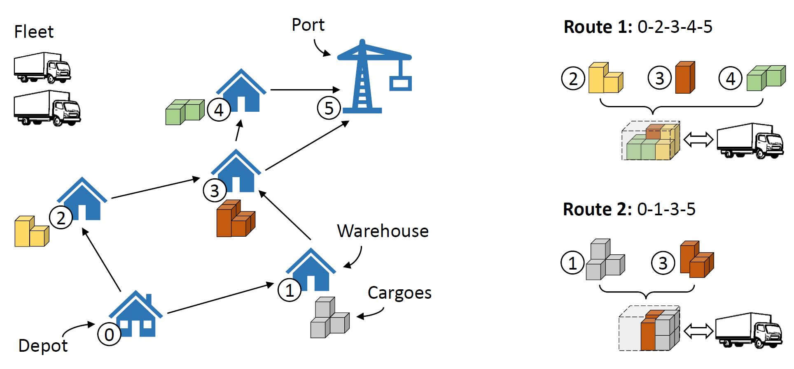
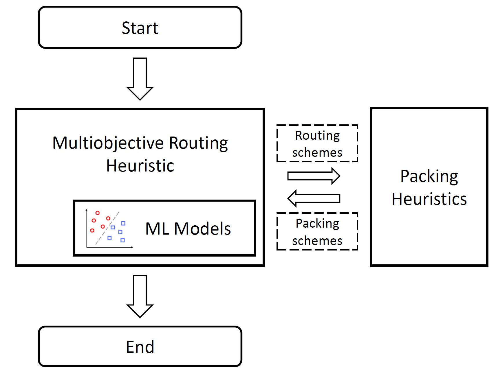

# M3LSDVRP
 Multiobjective Solver with ML Models for routing and packing. 

> This is the code for paper "Machine Learning Assisted Multiobjective Evolutionary Algorithm for Routing and Packing" *online version out soon*


Multi-objective split delivery vehicle routing problem with 3-dimensional loading constraints (**M3LSDVRP**)



**Framework of multiobjective routing packing solver**



1. Installation:

   + Download 

   + Compile a jar file named [name.jar] with RPSolver.java as the entrance 

2. Usage: Examples and guidelines on how to use the project.

   > java -jar name.jar ./ 4 2 1 60 0.4 1

3. Parameters:

   **arg 0** : path of inputs and outputs and ML models (default current path "./")

   **arg 1**: type of ML models (default 4)

   **arg 2**: type of packing heuristic (default 2)

   **arg 3**: number of repeat, invalid, maximum running time is set to be the stopping criteria (default 1)

   **arg 4:** maximum running time (default 60)

   **arg 5**: theta (default 0.4)

   **arg 6**: encoding strategy (default 1)

   ```java
   	String input_directory = args[0]+"/data/inputs"; 
   	String output_directory = args[0]+"/data/outputs";	
   	String model_directory = args[0]+"/model/"; 
   	classifier_type = Integer.valueOf(args[1]).intValue(); 	
   	// type of classifier: 0=linear, 1=MNB, 2=logistic regression, 3=svm_rbf, 4=CART, 5=random forest 10,6=random forest 20,7=random forest 50
   	packing_type = Integer.valueOf(args[2]).intValue();
   	// type of packing: 0=simpleHeuristic, 1=simpleHeuristic+newHeuristic1, 2=simpleHeuristic+newHeuristic1+newHeuristic2	
   	n_repeat = Integer.valueOf(args[3]).intValue();
   	n_repeat = 10000; 
   	// number of repeats: 1	
   	TIME_LIMITS = Integer.valueOf(args[4]).intValue();
   	// time limit: 60
   	theta = Double.valueOf(args[5]);
   	// theta: 0.2,0.3,0.4,0.5,0.6,0.7
   	encoding_strategy = Integer.valueOf(args[6]).intValue();
   	// encoding strategies: 1: full, 2, 3, 4
   ```

   

4. Results:

5. Visualization:

   An online visualization platform is provided by HUAWEI in https://www.noahlab.com.hk/logistics-ranking/#/simulator

   The results can be loaded in the platform for visualization and analysis

6. License: MIT
